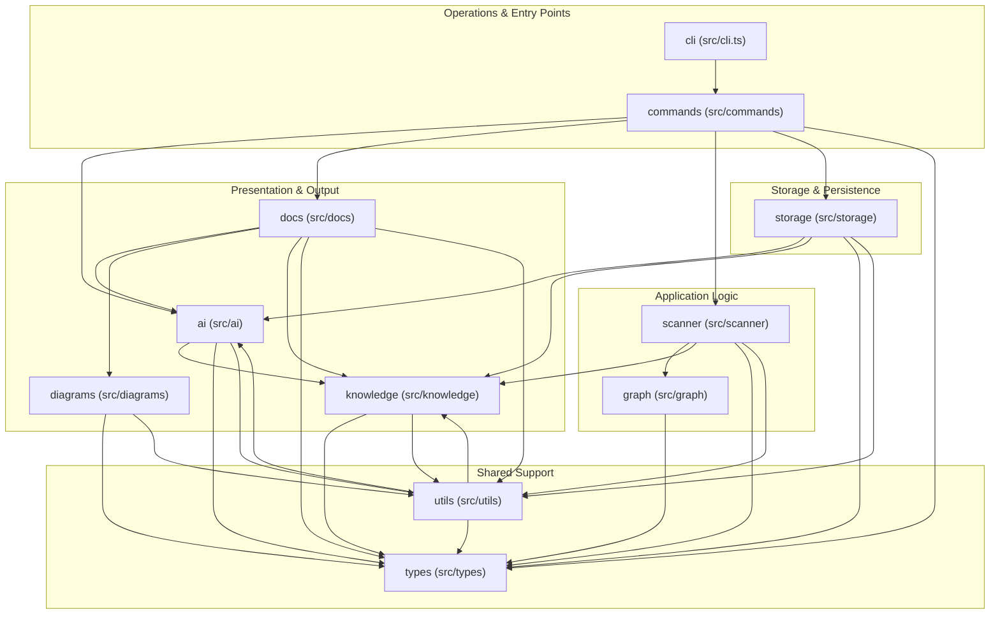
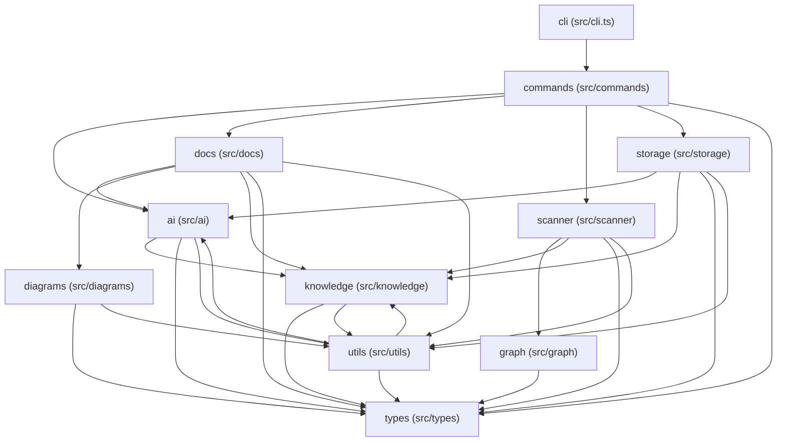
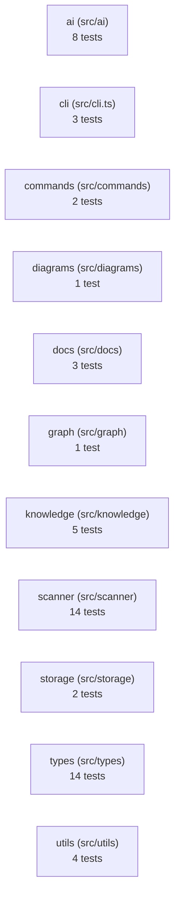

# Architecture

> How this system is organized: its layers, its dependencies, and the data that flows through it.

## At a Glance

| | | | |
| --- | --- | --- | --- |
| **Modules** | **Files** | **Import edges** | **Tests** |
| 11 | 115 | 470 | 35 |
| isolated units | scanned | dependencies | coverage files |
| **Routes** | **Areas** |  |  |
| 0 | 5 |  |  |
| no API | functional groups |  |  |

## On This Page

## On This Page

- [The System in One Paragraph](#the-system-in-one-paragraph)
- [Layered View](#layered-view)
- [Module Map](#module-map)
- [High-Level Structure](#high-level-structure)
- [Module Areas](#module-areas)
- [Data Flow](#data-flow)
- [Key Module Flows](#key-module-flows)
- [Key Files](#key-files)
- [API Routes](#api-routes)
- [Database & Migrations](#database-and-migrations)
- [Design System](#design-system)
- [External Dependencies](#external-dependencies)
- [Verification](#verification)

## The System in One Paragraph

RepoWiki is a Node/TypeScript project with 11 modules organized into 5 functional areas.

**Entry points** live in the `Operations and entry points: cli (src/cli.ts) + commands (src/commands)` area — these are the runnable scripts and CLI commands users invoke.

**Domain logic** lives in the `Core application logic: graph (src/graph) + scanner (src/scanner)` area — this is where the core analysis and scanning happens.

**Output generation** lives in the `Presentation and output: ai (src/ai) + diagrams (src/diagrams) + 2 more` area — this is where the system formats results into docs, diagrams, and AI summaries.

**Shared support** (types, helpers, utilities) lives in the `Shared support: types (src/types) + utils (src/utils)` area — every other area depends on it.


> **💡 Reading path**
>
> If you're new here: read **Layered View** to see the system shape, then **Data Flow** to see how a request moves through it, then jump to the [module doc](modules/src-cli.md) you'll be changing.

## Layered View

> **ℹ️ What is a layer?**
>
> Layers group modules by what they do, not where they live. Operations (entry points) call into Application Logic (domain code), which depends on Storage (persistence) and Shared Support (types, utilities). Presentation modules read everything and format output.

- **Application Logic (Analysis & Detection)**: [Core application logic: graph (src/graph) + scanner (src/scanner)](areas/analysis-src-graph-src-scanner.md), [Core application logic: storage (src/storage)](areas/analysis-src-storage.md)
- **Operations & Entry Points**: [Operations and entry points: cli (src/cli.ts) + commands (src/commands)](areas/orchestration-src-cli-src-commands.md)
- **Presentation & Output Generation**: [Presentation and output: ai (src/ai) + diagrams (src/diagrams) + 2 more](areas/generation-src-ai-src-diagrams-src-docs-src-knowledge.md)
- **Shared Support (Types, Utilities)**: [Shared support: types (src/types) + utils (src/utils)](areas/support-src-types-src-utils.md)

### Layer Diagram



## Module Map

### Module Dependency Diagram



> **💡 Reading the diagram**
>
> An arrow from A to B means "A imports from B". The module at the head of the arrow is depended on; the module at the tail is the consumer. Most-used modules have many incoming arrows.

## High-Level Structure

## Modules

- `ai (src/ai)` — Likely orchestrates AI summaries and context packs for the wiki. 9 files belong to this module.…
- `cli (src/cli.ts)` — Likely implements CLI command entry points and orchestration. 1 file belong to this module. Main files: src/cli.ts. Entry files: src/cli.ts:36.…
- `commands (src/commands)` — Likely implements CLI command entry points and orchestration. 5 files belong to this module.…
- `diagrams (src/diagrams)` — Likely generates repository diagrams and flow visuals. 1 file belong to this module. Main files: src/diagrams/generateDiagrams.ts.…
- `docs (src/docs)` — Likely generates repository wiki pages, flow docs, and AGENTS.md instructions. 15 files belong to this module.…
- `graph (src/graph)` — Likely builds the repository import graph and route relationships. 1 file belong to this module. Main files: src/graph/buildGraph.ts. Entry files: src/graph/buildGraph.ts:4.…
- `knowledge (src/knowledge)` — Likely derives evidence-backed repository knowledge, summaries, and change guidance. 10 files belong to this module.…
- `scanner (src/scanner)` — Likely scans files and builds repository graph metadata. 12 files belong to this module.…
- `storage (src/storage)` — Likely handles persistence, metadata, cached state, or storage-backed records. 1 file belong to this module. Main files: src/storage/metadataStore.ts.…
- `types (src/types)` — Likely defines shared records for files, graphs, summaries, tests, and change targets. 1 file belong to this module. Main files: src/types/index.ts.…
- `utils (src/utils)` — Likely provides shared filesystem, hashing, markdown, and path helpers. 15 files belong to this module.…


> **ℹ️ What is a module?**
>
> A module is a folder or file with a coherent purpose. Modules group related code so you can reason about one concern at a time. Click through to the [module docs](modules/src-cli.md) for file-level detail.

## Module Areas

## Area Summaries

- `Operations and entry points: cli (src/cli.ts) + commands (src/commands)` — Coordinates runnable entry points, scripts, commands, and top-level execution flow. Covers cli (src/cli.ts), commands (src/commands).…
- `Core application logic: graph (src/graph) + scanner (src/scanner)` — Contains domain behavior, application state, services, routing, and data flow. Covers graph (src/graph), scanner (src/scanner). Modules: graph (src/graph), scanner (src/scanner).…
- `Core application logic: storage (src/storage)` — Contains domain behavior, application state, services, routing, and data flow. Rooted at src/storage. Modules: storage (src/storage). Root paths: src/storage.…
- `Presentation and output: ai (src/ai) + diagrams (src/diagrams) + 2 more` — Contains UI, presentation, docs, generated output, or user-facing surfaces. Covers ai (src/ai), diagrams (src/diagrams), docs (src/docs), knowledge (src/knowledge).…
- `Shared support: types (src/types) + utils (src/utils)` — Provides shared persistence, configuration, types, and utility helpers. Covers types (src/types), utils (src/utils). Modules: types (src/types), utils (src/utils).…


## Area Docs

- [Operations and entry points: cli (src/cli.ts) + commands (src/commands)](areas/orchestration-src-cli-src-commands.md) — 2 modules
- [Core application logic: graph (src/graph) + scanner (src/scanner)](areas/analysis-src-graph-src-scanner.md) — 2 modules
- [Core application logic: storage (src/storage)](areas/analysis-src-storage.md) — 1 module
- [Presentation and output: ai (src/ai) + diagrams (src/diagrams) + 2 more](areas/generation-src-ai-src-diagrams-src-docs-src-knowledge.md) — 4 modules
- [Shared support: types (src/types) + utils (src/utils)](areas/support-src-types-src-utils.md) — 2 modules


## Data Flow

## Key Module Flows

- `ai (src/ai)` → `knowledge (src/knowledge)` (13 imports)
- `ai (src/ai)` → `types (src/types)` (5 imports)
- `ai (src/ai)` → `utils (src/utils)` (9 imports)
- `cli (src/cli.ts)` → `commands (src/commands)` (5 imports)
- `commands (src/commands)` → `ai (src/ai)` (13 imports)
- `commands (src/commands)` → `docs (src/docs)` (4 imports)
- `commands (src/commands)` → `scanner (src/scanner)` (5 imports)
- `commands (src/commands)` → `storage (src/storage)` (5 imports)
- `commands (src/commands)` → `types (src/types)`
- `diagrams (src/diagrams)` → `types (src/types)`
- `diagrams (src/diagrams)` → `utils (src/utils)`
- `docs (src/docs)` → `ai (src/ai)` (6 imports)
- `docs (src/docs)` → `diagrams (src/diagrams)` (2 imports)
- `docs (src/docs)` → `knowledge (src/knowledge)` (33 imports)
- `docs (src/docs)` → `types (src/types)` (15 imports)
- `docs (src/docs)` → `utils (src/utils)` (70 imports)
- `graph (src/graph)` → `types (src/types)`
- `knowledge (src/knowledge)` → `types (src/types)` (10 imports)
- `knowledge (src/knowledge)` → `utils (src/utils)` (10 imports)
- `scanner (src/scanner)` → `graph (src/graph)`
- `scanner (src/scanner)` → `knowledge (src/knowledge)` (2 imports)
- `scanner (src/scanner)` → `types (src/types)` (11 imports)
- `scanner (src/scanner)` → `utils (src/utils)` (13 imports)
- `storage (src/storage)` → `ai (src/ai)`
- `storage (src/storage)` → `knowledge (src/knowledge)` (2 imports)
- `storage (src/storage)` → `types (src/types)`
- `storage (src/storage)` → `utils (src/utils)` (2 imports)
- `utils (src/utils)` → `ai (src/ai)`
- `utils (src/utils)` → `knowledge (src/knowledge)` (2 imports)
- `utils (src/utils)` → `types (src/types)` (4 imports)

## Area Flows

- `Presentation and output: ai (src/ai) + diagrams (src/diagrams) + 2 more` → `Shared support: types (src/types) + utils (src/utils)` (121 imports)
- `Core application logic: graph (src/graph) + scanner (src/scanner)` → `Shared support: types (src/types) + utils (src/utils)` (25 imports)
- `Operations and entry points: cli (src/cli.ts) + commands (src/commands)` → `Presentation and output: ai (src/ai) + diagrams (src/diagrams) + 2 more` (17 imports)
- `Operations and entry points: cli (src/cli.ts) + commands (src/commands)` → `Core application logic: graph (src/graph) + scanner (src/scanner)` (5 imports)
- `Operations and entry points: cli (src/cli.ts) + commands (src/commands)` → `Core application logic: storage (src/storage)` (5 imports)
- `Core application logic: storage (src/storage)` → `Presentation and output: ai (src/ai) + diagrams (src/diagrams) + 2 more` (3 imports)
- `Core application logic: storage (src/storage)` → `Shared support: types (src/types) + utils (src/utils)` (3 imports)
- `Shared support: types (src/types) + utils (src/utils)` → `Presentation and output: ai (src/ai) + diagrams (src/diagrams) + 2 more` (3 imports)

## Test Coverage

### Coverage Diagram



## Coverage by Module

- `scanner (src/scanner)` — 14 tests (`test/detectComponents.test.ts:2` covers, `test/detectDesignSystem.test.ts:2` covers, `test/detectDesignTokens.test.ts:2` covers)
- `types (src/types)` — 14 tests (`test/aiBuildSummaries.test.ts:2` covers, `test/areaFlows.test.ts:2` covers, `test/buildGraph.test.ts:2` covers)
- `ai (src/ai)` — 8 tests (`test/aiBuildSummaries.test.ts:2` covers, `test/aiPrompt.test.ts:2` covers, `test/aiSummaryCache.test.ts:5` covers)
- `knowledge (src/knowledge)` — 5 tests (`test/areaFlows.test.ts:2` covers, `test/fileImportance.test.ts:2` covers, `test/knowledge.test.ts:5` covers)
- `utils (src/utils)` — 4 tests (`test/cli.e2e.test.ts:8` covers, `test/packageManager.test.ts:2` covers, `test/sourceText.test.ts:2` covers)
- `cli (src/cli.ts)` — 3 tests (`test/cli.e2e.test.ts:8` covers, `test/detectTests.test.ts:2` covers, `test/generateDocs.test.ts:2` covers)
- `docs (src/docs)` — 3 tests (`test/agentsMd.test.ts:2` covers, `test/detectTests.test.ts:2` covers, `test/generateDocs.test.ts:2` covers)
- `commands (src/commands)` — 2 tests (`test/checkCommand.test.ts:5` covers, `test/update.test.ts:2` covers)
- `storage (src/storage)` — 2 tests (`test/metadataArtifacts.test.ts:5` covers, `test/metadataStore.test.ts:5` covers)
- `diagrams (src/diagrams)` — 1 test (`test/diagrams.test.ts:2` covers)
- `graph (src/graph)` — 1 test (`test/buildGraph.test.ts:2` covers)


## Key Files

> **ℹ️ What makes a file "key"?**
>
> Key files are the ones other files import from most often. Changing them ripples through the codebase, so read them carefully before editing.

- `src/types/index.ts` — 63 incoming imports
- `src/utils/markdown.ts` — 17 incoming imports
- `src/knowledge/moduleFocus.ts` — 14 incoming imports
- `src/ai/types.ts` — 14 incoming imports
- `src/knowledge/areaOrdering.ts` — 15 incoming imports
- `src/utils/moduleLabel.ts` — 12 incoming imports
- `src/ai/summaryFormat.ts` — 8 incoming imports
- `src/knowledge/areaFlows.ts` — 11 incoming imports
- `src/ai/contextPacks.ts` — 6 incoming imports
- `src/utils/docPaths.ts` — 11 incoming imports

## Important Entry Files

- `src/cli.ts:36` — Defines 7 symbols used inside this module.
- `src/types/index.ts:198` — Central implementation file with exported behavior.
- `src/docs/generateAgentsMd.ts:14` — Imported by 2 external files.
- `src/docs/writeDocs.ts:30` — Imported by 4 external files.
- `src/utils/markdown.ts:30` — Imported by 14 external files.
- `src/utils/moduleLabel.ts:3` — Imported by 12 external files.
- `src/scanner/detectDesignTokens.ts:18` — Imported by 1 external file.
- `src/scanner/scanRepo.ts:64` — Imported by 8 external files.

## API Routes

> **ℹ️ Route diagram**
>
> Routes are API entry points. The diagram below shows each route and the file that defines it.

```mermaid
flowchart TD
  %% No routes detected
```

_No routes detected._

## Route Summaries

_No route summaries available._


## Database & Migrations

_No database or migration files detected._

## Design System

- No primary UI framework detected.
- No UI component files detected.
- No design token files detected.
- No Storybook configuration detected.

See [Design system overview](design.md) for full component and token details.

## External Dependencies

- `commander`
- `fast-glob`
- `simple-git`

## Development Dependencies

- `@types/node`
- `tsx`
- `typescript`
- `vitest`

## Runtime Consumers

_No runtime consumers detected._

## Test Consumers

- `test/generateDocs.test.ts` -> `src/docs/generateAgentContextDoc.ts`, `src/docs/generateArchitectureDoc.ts`, `src/docs/generateAreaDoc.ts`, `src/docs/generateAreasIndexDoc.ts` (9 imports into the repo)
- `test/knowledge.test.ts` -> `src/knowledge/areaOrdering.ts`, `src/knowledge/buildKnowledge.ts`, `src/knowledge/moduleFocus.ts`, `src/scanner/scanRepo.ts` (4 imports into the repo)
- `test/areaFlows.test.ts` -> `src/knowledge/areaFlows.ts`, `src/knowledge/moduleAreas.ts`, `src/types/index.ts` (3 imports into the repo)
- `test/detectTests.test.ts` -> `src/docs/generateAgentsMd.ts`, `src/scanner/detectTests.ts`, `src/types/index.ts` (3 imports into the repo)
- `test/metadataArtifacts.test.ts` -> `src/ai/contextPacks.ts`, `src/scanner/scanRepo.ts`, `src/storage/metadataStore.ts` (3 imports into the repo)
- `test/aiBuildSummaries.test.ts` -> `src/ai/buildSummaries.ts`, `src/types/index.ts` (2 imports into the repo)
- `test/aiPrompt.test.ts` -> `src/ai/prompt.ts`, `src/ai/types.ts` (2 imports into the repo)
- `test/aiSummaryCache.test.ts` -> `src/ai/summaryCache.ts`, `src/ai/types.ts` (2 imports into the repo)

## Common Change Paths

- `Change operations, scripts, or entry behavior` -> `src/cli.ts`, `src/commands/check.ts`, `src/commands/generate.ts`, `src/commands/review.ts` - Start in runnable entry points, scripts, and top-level orchestration. (evidence: `Operations and entry points: cli (src/cli.ts) + commands (src/commands)`, `src/cli.ts`, `src/commands/check.ts`, `src/commands/generate.ts`)
- `Change core application behavior` -> `src/graph/buildGraph.ts`, `src/scanner/detectComponents.ts`, `src/scanner/detectDesignSystem.ts`, `src/scanner/detectDesignTokens.ts` - Start in the domain, service, state, routing, or data-flow modules. (evidence: `Core application logic: graph (src/graph) + scanner (src/scanner)`, `src/graph/buildGraph.ts`, `src/scanner/detectComponents.ts`, `src/scanner/detectDesignSystem.ts`)
- `Change UI, docs, or generated output` -> `src/docs/generateAgentsMd.ts`, `src/docs/writeDocs.ts`, `src/ai/buildInsights.ts`, `src/ai/buildSummaries.ts` - Start in user-facing presentation, docs, or output-generation modules. (evidence: `Presentation and output: ai (src/ai) + diagrams (src/diagrams) + 2 more`, `src/docs/generateAgentsMd.ts`, `src/docs/writeDocs.ts`, `src/ai/buildInsights.ts`)
- `Change shared types, configuration, persistence, or helpers` -> `src/types/index.ts`, `src/utils/markdown.ts`, `src/utils/moduleLabel.ts`, `src/utils/changePaths.ts` - Start in shared utility, configuration, storage, and type layers. (evidence: `Shared support: types (src/types) + utils (src/utils)`, `src/types/index.ts`, `src/utils/markdown.ts`, `src/utils/moduleLabel.ts`)

## Verification

- Run the project build: package.json - Use the build script to catch type and bundling issues. Command: npm run build. (evidence: package.json)
- Run the project test suite: package.json - Use the package test script to verify repository-wide changes. Command: npm run test. (evidence: package.json)
- Review representative tests: test/agentsMd.test.ts:2, test/aiBuildSummaries.test.ts:2, test/aiPrompt.test.ts:2 - These tests show the expected behavior at the repo level. (evidence: test/agentsMd.test.ts:2, test/aiBuildSummaries.test.ts:2, test/aiPrompt.test.ts:2)

## Flow Docs

- [Flow overview](flows/index.md) — execution paths and module relationships
- [Module flow docs](flows/modules/src-cli.md) — per-module flow detail
