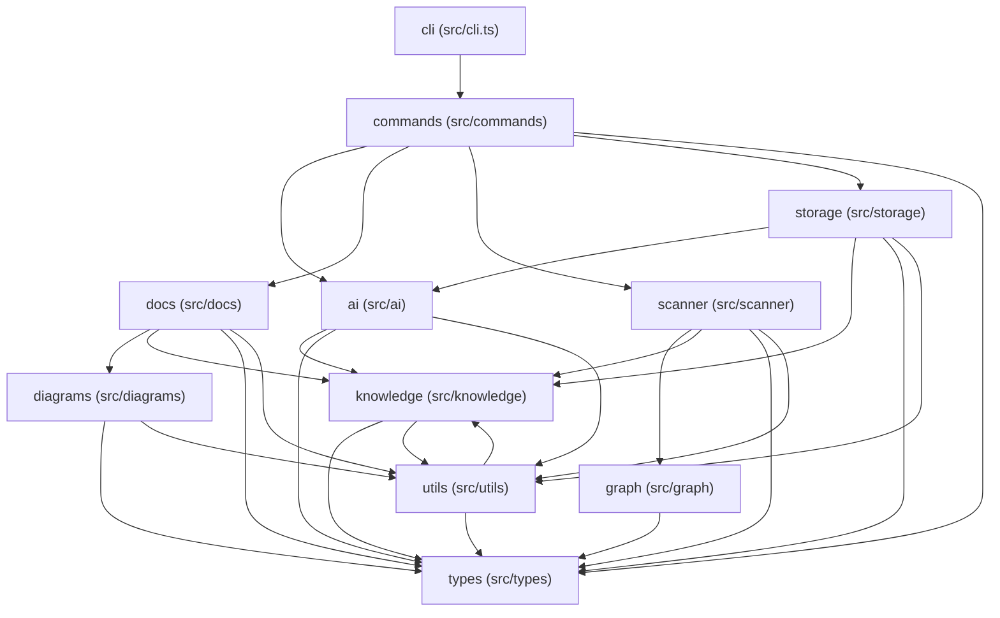

# Architecture

## High-Level Structure

- `ai (src/ai)`: Likely orchestrates AI summaries and context packs for the wiki.
- `cli (src/cli.ts)`: Likely implements CLI command entry points and orchestration.
- `commands (src/commands)`: Likely implements CLI command entry points and orchestration.
- `diagrams (src/diagrams)`: Likely generates repository diagrams and flow visuals.
- `docs (src/docs)`: Likely generates repository wiki pages, flow docs, and AGENTS.md instructions.
- `graph (src/graph)`: Likely builds the repository import graph and route relationships.
- `knowledge (src/knowledge)`: Likely derives evidence-backed repository knowledge, summaries, and change guidance.
- `scanner (src/scanner)`: Likely scans files and builds repository graph metadata.
- `storage (src/storage)`: Likely handles persistence, metadata, cached state, or storage-backed records.
- `types (src/types)`: Likely defines shared records for files, graphs, summaries, tests, and change targets.
- `utils (src/utils)`: Likely provides shared filesystem, hashing, markdown, and path helpers.

## Module Areas

- `Operations and entry points: cli (src/cli.ts) + commands (src/commands)` - 2 modules (`src/cli.ts`, `src/commands`) - Coordinates runnable entry points, scripts, commands, and top-level execution flow. Covers cli (src/cli.ts), commands (src/commands).
- `Core application logic: graph (src/graph) + scanner (src/scanner)` - 2 modules (`src/graph`, `src/scanner`) - Contains domain behavior, application state, services, routing, and data flow. Covers graph (src/graph), scanner (src/scanner).
- `Core application logic: storage (src/storage)` - 1 module (`src/storage`) - Contains domain behavior, application state, services, routing, and data flow. Rooted at src/storage.
- `Presentation and output: ai (src/ai) + diagrams (src/diagrams) + 2 more` - 4 modules (`src/ai`, `src/diagrams`, `src/docs`, `src/knowledge`) - Contains UI, presentation, docs, generated output, or user-facing surfaces. Covers ai (src/ai), diagrams (src/diagrams), docs (src/docs), knowledge (src/knowledge).
- `Shared support: types (src/types) + utils (src/utils)` - 2 modules (`src/types`, `src/utils`) - Provides shared persistence, configuration, types, and utility helpers. Covers types (src/types), utils (src/utils).

## Area Summaries

- - `Operations and entry points: cli (src/cli.ts) + commands (src/commands)` - Coordinates runnable entry points, scripts, commands, and top-level execution flow. Covers cli (src/cli.ts), commands (src/commands).…
- - `Core application logic: graph (src/graph) + scanner (src/scanner)` - Contains domain behavior, application state, services, routing, and data flow. Covers graph (src/graph), scanner (src/scanner). Modules: graph (src/graph), scanner (src/scanner).…
- - `Core application logic: storage (src/storage)` - Contains domain behavior, application state, services, routing, and data flow. Rooted at src/storage. Modules: storage (src/storage). Root paths: src/storage.…
- - `Presentation and output: ai (src/ai) + diagrams (src/diagrams) + 2 more` - Contains UI, presentation, docs, generated output, or user-facing surfaces. Covers ai (src/ai), diagrams (src/diagrams), docs (src/docs), knowledge (src/knowledge).…
- - `Shared support: types (src/types) + utils (src/utils)` - Provides shared persistence, configuration, types, and utility helpers. Covers types (src/types), utils (src/utils). Modules: types (src/types), utils (src/utils).…

## Area Docs

- [Operations and entry points: cli (src/cli.ts) + commands (src/commands)](areas/orchestration-src-cli-src-commands.md) - 2 modules
- [Core application logic: graph (src/graph) + scanner (src/scanner)](areas/analysis-src-graph-src-scanner.md) - 2 modules
- [Core application logic: storage (src/storage)](areas/analysis-src-storage.md) - 1 module
- [Presentation and output: ai (src/ai) + diagrams (src/diagrams) + 2 more](areas/generation-src-ai-src-diagrams-src-docs-src-knowledge.md) - 4 modules
- [Shared support: types (src/types) + utils (src/utils)](areas/support-src-types-src-utils.md) - 2 modules

## Area Flows

- `Presentation and output: ai (src/ai) + diagrams (src/diagrams) + 2 more` -> `Shared support: types (src/types) + utils (src/utils)` (110 imports)
- `Core application logic: graph (src/graph) + scanner (src/scanner)` -> `Shared support: types (src/types) + utils (src/utils)` (20 imports)
- `Operations and entry points: cli (src/cli.ts) + commands (src/commands)` -> `Presentation and output: ai (src/ai) + diagrams (src/diagrams) + 2 more` (9 imports)
- `Operations and entry points: cli (src/cli.ts) + commands (src/commands)` -> `Core application logic: graph (src/graph) + scanner (src/scanner)` (4 imports)
- `Operations and entry points: cli (src/cli.ts) + commands (src/commands)` -> `Core application logic: storage (src/storage)` (4 imports)
- `Core application logic: storage (src/storage)` -> `Presentation and output: ai (src/ai) + diagrams (src/diagrams) + 2 more` (3 imports)
- `Core application logic: storage (src/storage)` -> `Shared support: types (src/types) + utils (src/utils)` (3 imports)
- `Core application logic: graph (src/graph) + scanner (src/scanner)` -> `Presentation and output: ai (src/ai) + diagrams (src/diagrams) + 2 more` (2 imports)

## Important Config Files

- `package.json`
- `tsconfig.json`
- `vitest.config.ts`

## Import Graph Summary

- Import edges detected: 407
- Files with imports: 87

## Key Module Flows

- `ai (src/ai)` -> `knowledge (src/knowledge)` (13 imports)
- `ai (src/ai)` -> `types (src/types)` (3 imports)
- `ai (src/ai)` -> `utils (src/utils)` (7 imports)
- `cli (src/cli.ts)` -> `commands (src/commands)` (4 imports)
- `commands (src/commands)` -> `ai (src/ai)` (6 imports)
- `commands (src/commands)` -> `docs (src/docs)` (3 imports)
- `commands (src/commands)` -> `scanner (src/scanner)` (4 imports)
- `commands (src/commands)` -> `storage (src/storage)` (4 imports)
- `commands (src/commands)` -> `types (src/types)`
- `diagrams (src/diagrams)` -> `types (src/types)`
- `diagrams (src/diagrams)` -> `utils (src/utils)`
- `docs (src/docs)` -> `diagrams (src/diagrams)` (2 imports)
- `docs (src/docs)` -> `knowledge (src/knowledge)` (33 imports)
- `docs (src/docs)` -> `types (src/types)` (13 imports)
- `docs (src/docs)` -> `utils (src/utils)` (65 imports)
- `graph (src/graph)` -> `types (src/types)`
- `knowledge (src/knowledge)` -> `types (src/types)` (10 imports)
- `knowledge (src/knowledge)` -> `utils (src/utils)` (10 imports)
- `scanner (src/scanner)` -> `graph (src/graph)`
- `scanner (src/scanner)` -> `knowledge (src/knowledge)` (2 imports)
- `scanner (src/scanner)` -> `types (src/types)` (8 imports)
- `scanner (src/scanner)` -> `utils (src/utils)` (11 imports)
- `storage (src/storage)` -> `ai (src/ai)`
- `storage (src/storage)` -> `knowledge (src/knowledge)` (2 imports)
- `storage (src/storage)` -> `types (src/types)`
- `storage (src/storage)` -> `utils (src/utils)` (2 imports)
- `utils (src/utils)` -> `knowledge (src/knowledge)` (2 imports)
- `utils (src/utils)` -> `types (src/types)` (4 imports)

## Central Files

- `src/types/index.ts` - 55 incoming imports
- `src/knowledge/moduleFocus.ts` - 14 incoming imports
- `src/knowledge/areaOrdering.ts` - 15 incoming imports
- `src/utils/markdown.ts` - 14 incoming imports
- `src/utils/moduleLabel.ts` - 12 incoming imports
- `src/knowledge/areaFlows.ts` - 11 incoming imports
- `src/utils/docPaths.ts` - 11 incoming imports
- `src/ai/contextPacks.ts` - 6 incoming imports
- `src/knowledge/verification.ts` - 8 incoming imports
- `src/ai/types.ts` - 8 incoming imports

## Important Entry Files

- `src/cli.ts:34` - Defines 7 symbols used inside this module.
- `src/types/index.ts:162` - Central implementation file with exported behavior.
- `src/utils/markdown.ts:6` - Imported by 12 external files.
- `src/utils/moduleLabel.ts:3` - Imported by 12 external files.
- `src/docs/generateAgentsMd.ts:13` - Imported by 2 external files.
- `src/docs/writeDocs.ts:28` - Imported by 3 external files.
- `src/knowledge/areaOrdering.ts:24` - Imported by 12 external files.
- `src/knowledge/moduleFocus.ts:18` - Imported by 12 external files.

## Test Coverage Summary

- `types (src/types)` - 13 tests (`test/aiBuildSummaries.test.ts:2` covers, `test/areaFlows.test.ts:2` covers, `test/buildGraph.test.ts:2` covers)
- `scanner (src/scanner)` - 11 tests (`test/detectEnvVars.test.ts:2` covers, `test/detectModules.test.ts:2` covers, `test/detectPathAliases.test.ts:5` covers)
- `ai (src/ai)` - 7 tests (`test/aiBuildSummaries.test.ts:2` covers, `test/aiPrompt.test.ts:2` covers, `test/aiSummaryFormat.test.ts:2` covers)
- `knowledge (src/knowledge)` - 5 tests (`test/areaFlows.test.ts:2` covers, `test/fileImportance.test.ts:2` covers, `test/knowledge.test.ts:5` covers)
- `utils (src/utils)` - 4 tests (`test/cli.e2e.test.ts:8` covers, `test/packageManager.test.ts:2` covers, `test/sourceText.test.ts:2` covers)
- `cli (src/cli.ts)` - 3 tests (`test/cli.e2e.test.ts:8` covers, `test/detectTests.test.ts:2` covers, `test/generateDocs.test.ts:2` covers)
- `docs (src/docs)` - 3 tests (`test/agentsMd.test.ts:2` covers, `test/detectTests.test.ts:2` covers, `test/generateDocs.test.ts:2` covers)
- `commands (src/commands)` - 2 tests (`test/checkCommand.test.ts:5` covers, `test/update.test.ts:2` covers)
- `storage (src/storage)` - 2 tests (`test/metadataArtifacts.test.ts:5` covers, `test/metadataStore.test.ts:5` covers)
- `diagrams (src/diagrams)` - 1 test (`test/diagrams.test.ts:2` covers)
- `graph (src/graph)` - 1 test (`test/buildGraph.test.ts:2` covers)

## API Routes

_None detected._

## Route Summaries

_No route summaries available._

## Database And Migrations

_None detected._

## External Dependencies

- `commander`
- `fast-glob`
- `simple-git`

## Development Dependencies

- `@types/node`
- `tsx`
- `typescript`
- `vitest`

## Runtime Consumers

_No runtime consumers detected._

## Test Consumers

- `test/generateDocs.test.ts` -> `src/docs/generateAgentContextDoc.ts`, `src/docs/generateArchitectureDoc.ts`, `src/docs/generateAreaDoc.ts`, `src/docs/generateAreasIndexDoc.ts` (9 imports into the repo)
- `test/knowledge.test.ts` -> `src/knowledge/areaOrdering.ts`, `src/knowledge/buildKnowledge.ts`, `src/knowledge/moduleFocus.ts`, `src/scanner/scanRepo.ts` (4 imports into the repo)
- `test/areaFlows.test.ts` -> `src/knowledge/areaFlows.ts`, `src/knowledge/moduleAreas.ts`, `src/types/index.ts` (3 imports into the repo)
- `test/detectTests.test.ts` -> `src/docs/generateAgentsMd.ts`, `src/scanner/detectTests.ts`, `src/types/index.ts` (3 imports into the repo)
- `test/metadataArtifacts.test.ts` -> `src/ai/contextPacks.ts`, `src/scanner/scanRepo.ts`, `src/storage/metadataStore.ts` (3 imports into the repo)
- `test/aiBuildSummaries.test.ts` -> `src/ai/buildSummaries.ts`, `src/types/index.ts` (2 imports into the repo)
- `test/aiPrompt.test.ts` -> `src/ai/prompt.ts`, `src/ai/types.ts` (2 imports into the repo)
- `test/buildGraph.test.ts` -> `src/graph/buildGraph.ts`, `src/types/index.ts` (2 imports into the repo)

## Common Change Paths

- `Change operations, scripts, or entry behavior` -> `src/cli.ts`, `src/commands/check.ts`, `src/commands/generate.ts`, `src/commands/review.ts` - Start in runnable entry points, scripts, and top-level orchestration. (evidence: `Operations and entry points: cli (src/cli.ts) + commands (src/commands)`, `src/cli.ts`, `src/commands/check.ts`, `src/commands/generate.ts`)
- `Change core application behavior` -> `src/graph/buildGraph.ts`, `src/scanner/detectEnvVars.ts`, `src/scanner/detectModules.ts`, `src/scanner/detectPathAliases.ts` - Start in the domain, service, state, routing, or data-flow modules. (evidence: `Core application logic: graph (src/graph) + scanner (src/scanner)`, `src/graph/buildGraph.ts`, `src/scanner/detectEnvVars.ts`, `src/scanner/detectModules.ts`)
- `Change UI, docs, or generated output` -> `src/docs/generateAgentsMd.ts`, `src/docs/writeDocs.ts`, `src/ai/buildSummaries.ts`, `src/ai/contextPacks.ts` - Start in user-facing presentation, docs, or output-generation modules. (evidence: `Presentation and output: ai (src/ai) + diagrams (src/diagrams) + 2 more`, `src/docs/generateAgentsMd.ts`, `src/docs/writeDocs.ts`, `src/ai/buildSummaries.ts`)
- `Change shared types, configuration, persistence, or helpers` -> `src/types/index.ts`, `src/utils/markdown.ts`, `src/utils/moduleLabel.ts`, `src/utils/changePaths.ts` - Start in shared utility, configuration, storage, and type layers. (evidence: `Shared support: types (src/types) + utils (src/utils)`, `src/types/index.ts`, `src/utils/markdown.ts`, `src/utils/moduleLabel.ts`)

## Verification

- Run the project build: package.json - Use the build script to catch type and bundling issues. Command: npm run build. (evidence: package.json)
- Run the project test suite: package.json - Use the package test script to verify repository-wide changes. Command: npm run test. (evidence: package.json)
- Review representative tests: test/agentsMd.test.ts:2, test/aiBuildSummaries.test.ts:2, test/aiPrompt.test.ts:2 - These tests show the expected behavior at the repo level. (evidence: test/agentsMd.test.ts:2, test/aiBuildSummaries.test.ts:2, test/aiPrompt.test.ts:2)

## Module Diagram



## Route Diagram

```mermaid
flowchart TD
  %% No routes detected
```

## Flow Docs

- [Flow overview](flows/index.md)
